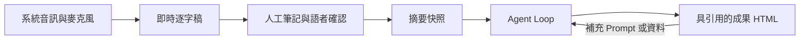
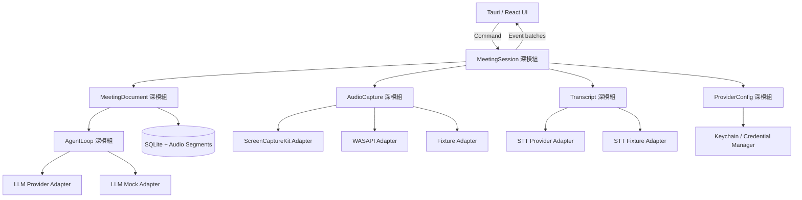
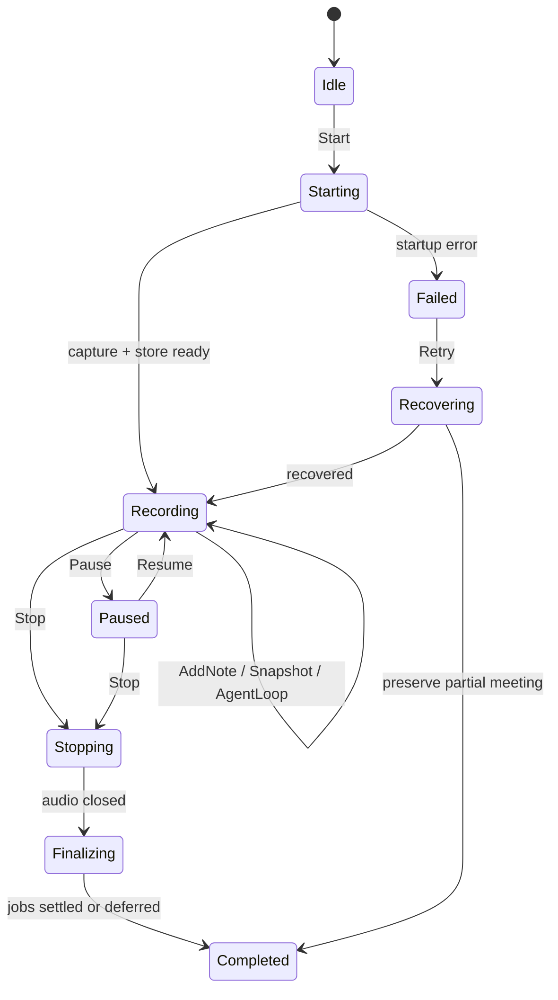
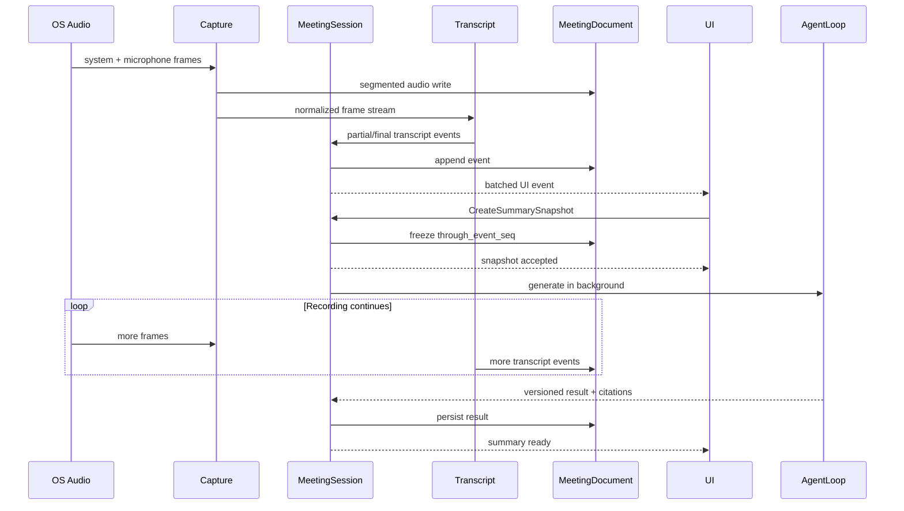

# OpenMeetNote 工程藍圖

狀態：施工前設計草案  
日期：2026-08-01  
適用平台：Windows、macOS

## 1. 產品目標

OpenMeetNote 將一場正在進行的會議轉換成可追溯、可持續修訂且能直接交付的成果文件。它不是單純錄音器、逐字稿工具或固定格式摘要器。

核心閉環如下：



成功條件：

1. 使用者能在 Windows 或 macOS 上直接開始錄製系統音訊與麥克風。
2. 錄製期間持續看到繁體中文逐字稿，英文技術詞彙不被不必要地翻譯。
3. 建立摘要或執行 Agent Loop 不得中斷音訊擷取與逐字稿寫入。
4. 每項重要結論可以追溯至逐字稿、人工筆記或附件。
5. Agent 可以改變文件結構，但不得把缺少證據的內容描述成會議事實。
6. 應用程式不要求帳號，資料與憑證由個人裝置管理。

## 2. 範圍與非目標

### 2.1 第一階段範圍

- Windows 與 macOS 桌面應用。
- 系統音訊與麥克風雙來源擷取。
- 即時串流逐字稿與穩定片段修訂。
- 語者分離、暫定名稱與人工確認。
- 時間戳人工筆記。
- 錄製中摘要快照與會後最終摘要。
- 會議搜尋、重新開啟與 HTML 匯出。
- GUI Provider 設定、環境變數覆寫、OS 憑證儲存。
- 通用 Agent Loop 與每次生成專用 Prompt。

### 2.2 第一階段非目標

- Android、iOS 或 Web 錄音。
- 帳號、團隊空間、雲端同步或多人共同編輯。
- 會議 Bot 加入 Zoom、Teams 或 Google Meet。
- 行事曆、CRM、知識圖譜或跨會議企業搜尋。
- 由程式內建「報價會議必定生成 SOW」之類的固定映射。
- 未經確認便從他人提及推定語者真實身份。

## 3. 設計原則

### 3.1 深模組

系統以少數深模組承擔複雜行為。呼叫端只理解小型 Interface；音訊執行緒、逐字稿修訂、快照一致性及 Agent 迭代細節保留在 Implementation 內。

### 3.2 真正變動處才建立 Seam

- macOS、Windows 與測試音訊來源不同，因此 `AudioCapture` 是真實 Seam。
- STT 與 LLM 會有多個 Provider 及測試替身，因此各自需要 Adapter。
- SQLite 儲存只有單一正式 Implementation；測試使用暫存 SQLite，不額外公開 Repository Interface。
- UI 與 Rust 核心之間只傳遞命令與批次事件，不暴露內部管線。

### 3.3 本機優先與失敗可恢復

- 逐字稿、筆記、狀態與生成版本先寫入本機 SQLite。
- 音訊以分段檔案寫入，避免單一檔案損毀整場會議。
- 網路或 Provider 失敗不影響錄音；可從持久化游標重試。

### 3.4 證據與推論分離

- `Fact`：可回到來源的會議內容。
- `Inference`：由 Agent 整理出的推論，必須明確標示。
- `Suggestion`：AI 補充建議，不等同決議。
- `Gap`：缺少、矛盾或尚未確認的資訊。

## 4. 系統架構



音訊 PCM 不可通過 WebView。UI 只接收節流後的音量、狀態、逐字稿及文件事件。

## 5. 深模組與 Interface

### 5.1 `MeetingSession`

責任：統一管理會議生命週期、命令排序、背景工作與可恢復狀態。

外部 Interface 保持為命令與事件兩個概念：

```rust
pub trait MeetingSession {
    async fn execute(&self, command: SessionCommand) -> Result<CommandReceipt>;
    fn events(&self) -> SessionEventStream;
}
```

主要命令：

- `Start`
- `Pause`
- `Resume`
- `AddNote`
- `ConfirmSpeaker`
- `CreateSummarySnapshot`
- `RunAgentLoop`
- `Stop`
- `RetryJob`

Interface 不允許呼叫端直接控制 Audio、STT 或 SQLite；所有一致性規則集中於此模組。

### 5.2 `AudioCapture`

責任：開啟音訊來源、統一格式、附加時間基準、偵測丟幀並輸出 PCM frame stream。

Adapter：

- macOS：ScreenCaptureKit 系統音訊＋麥克風。
- Windows：WASAPI Loopback 系統音訊＋麥克風。
- 測試：固定 WAV／PCM Fixture。

共同輸出格式在 PoC 後決定；初始候選為 48 kHz、單聲道或雙軌、32-bit float。混音前保留來源標記，便於除錯與未來語者策略。

### 5.3 `Transcript`

責任：將音訊送至 STT、處理 partial／final 修訂、語言正規化、時間對齊及語者標籤。

不可將每次 partial result 當成永久新句。每個片段包含穩定 ID 與 revision：

```text
segment_id + revision + start_ms + end_ms + text + speaker_id + stability
```

輸出規則：

- 主要文字為繁體中文。
- CMS、SLA、API、UAT 等英文詞彙原樣保留。
- STT 的簡體中文結果可在 final segment 階段轉換，partial 不做昂貴重寫。
- 使用者修訂不得被後續 Provider revision 覆蓋。

### 5.4 `MeetingDocument`

責任：管理逐字稿、人工筆記、語者映射、生成版本、引用與匯出。

所有寫入採 append-oriented event，再投影成目前文件狀態。摘要快照以 `through_event_seq` 固定涵蓋範圍，因此生成期間後續錄音可以繼續寫入。

```text
Snapshot v3 = meeting_id + through_event_seq 928 + prompt + created_at
```

### 5.5 `AgentLoop`

責任：根據本輪目標與證據規劃文件、產生草稿、檢查缺口、驗證引用並迭代。

唯一主要 Interface：

```rust
pub trait AgentLoop {
    async fn generate(&self, request: GenerationRequest) -> Result<GenerationResult>;
}
```

`GenerationRequest` 包含：

- 本輪使用者 Prompt，可為空。
- 指定的會議快照。
- 人工筆記、附件與已確認語者。
- 前一版文件，若為修訂。
- 最大輪數、時間與費用限制。

`GenerationResult` 回傳成果區塊、來源引用、缺口、建議、驗證結果與使用量，不直接寫檔。

### 5.6 `ProviderConfig`

責任：解析 GUI 設定、環境變數優先權及憑證存取，不讓其他模組理解儲存差異。

優先順序：

1. 作業系統環境變數。
2. GUI 選擇的 Provider 與非敏感設定。
3. Keychain／Credential Manager 中的密鑰。

密鑰不得存入 SQLite、設定檔、逐字稿、日誌或錯誤回報。

## 6. 會議狀態機



建立摘要快照與執行 Agent Loop 都是 `Recording → Recording`，不得停止 Capture 或等待 AI 才回到錄音狀態。

## 7. 即時資料流



## 8. 語者模型

### 8.1 預設行為

- Diarization 只建立穩定的 `speaker_id`，畫面顯示「語者 1」「語者 2」。
- 「我是王小明」可建立 `proposed_name = 王小明`，狀態為待確認。
- 使用者確認後才建立 `confirmed_name`。
- 「王小明剛才說……」不得用來認定目前發言者就是王小明。
- 語者合併或拆分保留稽核紀錄，引用仍指向原始片段。

### 8.2 名稱優先順序

```text
使用者確認名稱 > 使用者手動名稱 > 待確認自我介紹 > 語者 N
```

## 9. 通用 Agent Loop

### 9.1 禁止固定方向映射

系統不得實作以下規則：

```text
if meeting_type == "quotation" then render_sow_template()
```

報價、SOW、活動須知、研究報告、決策紀錄只可作為 Agent 可借用的參考結構。文件方向由本輪 Prompt、證據與成果目標共同形成。

### 9.2 迭代階段

1. **理解目標**：提取使用者希望達成的成果與限制。
2. **建立證據索引**：整理逐字稿、筆記、附件、既有版本與來源位置。
3. **規劃文件**：選擇或組合適合本輪的段落與視覺表達。
4. **產生草稿**：輸出結構化區塊，不直接拼接未轉義 HTML。
5. **缺口與矛盾檢查**：找出未知值、互相衝突的說法及語者不確定性。
6. **引用驗證**：所有 Decision／Fact 必須有有效 `SourceRef`。
7. **品質批判**：檢查是否滿足 Prompt、是否誤把建議當決議、是否有重複內容。
8. **迭代或停止**：在改善仍具意義且未超過限制時修訂，否則回傳最佳版本與未解缺口。

### 9.3 停止條件

- 所有必要成果已涵蓋，引用與一致性檢查通過。
- 缺少資料且必須由使用者或外部來源補充。
- 達到使用者設定的最大輪數、時間或費用。
- 新一輪沒有實質改善。
- 使用者取消。

Agent Loop 不得無限制自我呼叫。

### 9.4 Prompt Injection 防護

- 逐字稿與附件一律視為不受信任的證據內容。
- 證據內的指令不能改寫系統規則或本輪使用者 Prompt。
- HTML Renderer 對文字、URL 與屬性做結構化轉義。
- Mermaid 使用嚴格安全模式；不允許任意 script、iframe 或事件屬性。

## 10. HTML 成果模型

Agent 回傳受控的文件區塊，而不是任意 HTML 字串：

- `Heading`
- `Paragraph`
- `BulletList`
- `Table`
- `MermaidDiagram`
- `Callout`
- `Decision`
- `ActionItem`
- `Gap`
- `Suggestion`
- `SourceLink`
- `TranscriptExcerpt`

Renderer 統一負責樣式、導覽、錨點、列印、來源連結與可存取性。這使 Agent 能自由規劃內容方向，同時避免任意程式碼執行。

匯出的 HTML 至少包含：

- 成果摘要。
- 依本輪目標生成的詳細主文。
- 決議與行動項目（若證據存在）。
- 資訊缺口與 AI 建議，並與事實分離。
- 完整逐字稿或可選擇的逐字稿附件。
- 所有來源錨點與生成版本資訊。

## 11. 初始資料模型

| 資料表 | 目的 | 關鍵欄位 |
|---|---|---|
| `meetings` | 會議主資料與狀態 | `id`, `title`, `state`, `started_at`, `ended_at` |
| `audio_segments` | 分段音訊檔索引 | `meeting_id`, `track`, `path`, `start_ms`, `end_ms`, `checksum` |
| `transcript_segments` | 可修訂逐字稿片段 | `id`, `revision`, `text`, `speaker_id`, `stability`, `user_edited` |
| `speakers` | 語者與名稱確認 | `id`, `ordinal`, `proposed_name`, `confirmed_name`, `status` |
| `notes` | 時間戳人工筆記 | `id`, `event_seq`, `text`, `created_at` |
| `meeting_events` | Append-oriented 事件序列 | `seq`, `kind`, `payload`, `created_at` |
| `generation_runs` | 摘要與 Agent Loop 版本 | `id`, `through_event_seq`, `prompt`, `status`, `usage` |
| `document_blocks` | 受控成果區塊 | `run_id`, `position`, `kind`, `content` |
| `source_refs` | 成果到證據的引用 | `block_id`, `source_kind`, `source_id`, `start_ms`, `end_ms` |
| `provider_settings` | 非敏感 Provider 設定 | `kind`, `provider`, `model`, `base_url`, `options` |

正式 schema 必須在第一個垂直切片完成後，以實際查詢與交易需求驗證；不預先建立跨會議知識圖譜。

## 12. 效能與可靠性

以下是首輪量測目標，不是未經驗證的效能宣稱：

- 音訊 callback 不執行網路、SQLite、JSON 序列化或 UI 呼叫。
- 音訊 frame 透過有界佇列傳遞；背壓與丟幀必須被記錄。
- UI 事件採批次節流，不逐字或逐 frame 呼叫 WebView。
- 摘要及 Agent Loop 在獨立工作佇列執行，不能提高音訊丟幀率。
- 正常網路與 Provider 條件下，逐字稿端到端 p95 目標先設為 3 秒內，PoC 後重訂。
- 兩小時連續錄音壓力測試不得崩潰，記憶體必須趨於穩定。
- 應用程式非正常關閉後，可恢復已持久化的音訊、逐字稿與人工筆記。

效能優化流程：先以 profiling 找出 Capture、轉錄處理、SQLite 寫入與 UI event batching 的熱點，修改後重新量測；不得以主觀感覺宣稱最佳化完成。

## 13. 錯誤處理

| 失敗 | 必須行為 |
|---|---|
| 系統音訊權限拒絕 | 清楚指出缺少的權限與設定路徑；不可悄悄只錄麥克風 |
| 麥克風中斷 | 保留系統音訊並顯示 track degraded |
| STT 斷線 | 繼續錄音與持久化，排隊重試或會後補轉錄 |
| LLM 失敗 | 不影響錄音；保留 snapshot 並允許重試或更換 Provider |
| SQLite 暫時忙碌 | 有界重試並維持事件順序；不可在 audio callback 重試 |
| 磁碟空間不足 | 立即通知並安全停止錄音，保留已完成分段 |
| 應用程式崩潰 | 下次啟動偵測未完成會議並提供恢復 |

## 14. 安全與隱私

- 無帳號、無預設遙測、無跨裝置同步。
- Provider 呼叫前清楚顯示哪些資料會離開裝置。
- API Key 儲存在 macOS Keychain 或 Windows Credential Manager。
- 日誌預設不包含逐字稿全文、音訊、Prompt、附件或密鑰。
- 使用者可以刪除單場會議及其音訊、逐字稿、生成結果與索引。
- 對外錄音涉及的同意與法律責任須在首次使用時提示；實際文字依發布地區法規另行確認。

## 15. 測試策略

### 15.1 Interface 測試

- `MeetingSession`：使用 Fixture Audio、測試 STT 與 Mock LLM，從命令輸入驗證事件與持久化結果。
- `AgentLoop`：以固定會議證據驗證引用完整、缺口保留、建議與決議分離。
- `Transcript`：驗證 partial revision、final 穩定、使用者修訂不被覆蓋。

測試只跨模組 Interface，不依賴內部函式排列。

### 15.2 Adapter 契約測試

- macOS 與 Windows Capture Adapter 產生相同 PCM frame 契約。
- 各 STT Adapter 將 Provider 特有事件轉換成共同 Transcript Event。
- 各 LLM Adapter 回報一致的成功、限流、授權失敗與使用量資訊。

### 15.3 整合與系統測試

- 兩小時錄音 soak test。
- 網路斷線、Provider 限流與重新連線。
- 錄製中重複建立摘要快照。
- 崩潰恢復與 SQLite WAL 一致性。
- 中英文交錯、重疊發言、自我介紹與未確認語者。
- HTML snapshot／可存取性／列印 golden tests。
- Windows 與 macOS 安裝、升級、權限與解除安裝。

## 16. 開發階段

### M0：Repository 與藍圖

- 建立 Repository、工程藍圖與 HTML 原型。
- 定義雙平台 PoC 的可量測驗收條件。

### M1：雙平台 Capture PoC

- macOS ScreenCaptureKit＋麥克風。
- Windows WASAPI Loopback＋麥克風。
- 分段 WAV 寫入、音量資訊、丟幀統計與兩小時測試。

此階段失敗時先修正音訊架構，不開始完整 UI。

### M2：第一個垂直切片

- Tauri UI 可開始／停止會議。
- Capture → STT → 即時逐字稿 → SQLite → 重開會議。
- 使用 Fixture Adapter 建立可重複的整合測試。

### M3：語者與人工筆記

- Diarization、語者 N、待確認自我介紹、名稱修正。
- 時間戳人工筆記與引用。

### M4：不中斷摘要

- Snapshot cursor、背景生成、版本歷史、錯誤重試。
- 驗證生成期間不增加 Capture 丟幀。

### M5：通用 Agent Loop 與 HTML

- 動態文件規劃、缺口檢查、引用驗證及迭代停止條件。
- 安全 Renderer、Mermaid、表格、交叉引用、逐字稿與列印。

### M6：產品化

- GUI Provider 設定與 OS 憑證儲存。
- 效能 profiling、崩潰恢復、安裝包、簽章與更新策略。
- Windows 與 macOS 發布驗收。

## 17. 完成定義

OpenMeetNote 只有同時符合下列條件才可稱為第一版完工：

1. Windows 與 macOS 實機可擷取系統音訊與麥克風。
2. 兩小時會議能持續轉錄、寫入與恢復，沒有未說明的資料遺失。
3. 使用者可在錄音中建立多個摘要版本，錄音與逐字稿不中斷。
4. 語者預設與名稱確認規則符合本藍圖。
5. 人工筆記、逐字稿與附件可被 Agent Loop 引用。
6. 使用者 Prompt 能改變本輪文件方向，程式碼沒有固定會議類型映射。
7. 匯出 HTML 包含成果主文、必要圖表、來源引用、缺口、AI 建議與逐字稿。
8. API Key 不出現在檔案、SQLite 或日誌。
9. 狹義測試、雙平台整合測試與效能量測通過。
10. 安裝、權限提示、升級與解除安裝均完成實機驗證。

## 18. 尚待決策

以下選項必須透過 PoC 或使用者選擇決定，現階段不寫死：

- 第一個 STT Adapter 使用雲端串流或本機模型。
- 是否同時保留本機轉錄作為離線選項。
- 第一批 LLM Provider 與 OpenAI-compatible 支援範圍。
- Diarization 在串流階段或會後進行二次校正。
- 原始音訊預設保留期限與自動清理策略。
- HTML 是否完全單檔內嵌 Mermaid runtime，或允許外部資源。
- 專案授權。
- Windows code signing 與 macOS notarization 的發布身份。

## 19. Minutes 參考邊界

Minutes 可作為 MIT 架構參考，但 OpenMeetNote 不 Fork 其完整產品：

- 可參考或選擇性移植系統音訊 Interface、macOS Capture、摘要 Provider 與 Secret Store。
- 不繼承 CLI、MCP、行事曆、知識圖譜、跨會議智慧或其他非本產品範圍。
- 任何實際複製或修改的程式碼必須保留原始 MIT 授權與著作權聲明，並記錄於第三方聲明。

