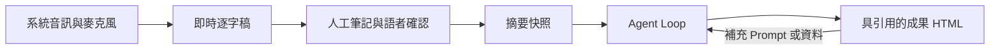
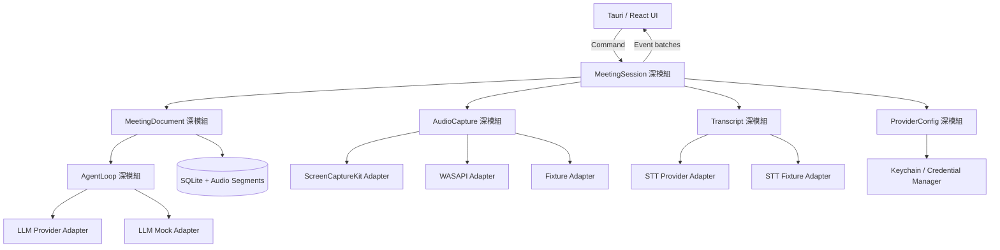
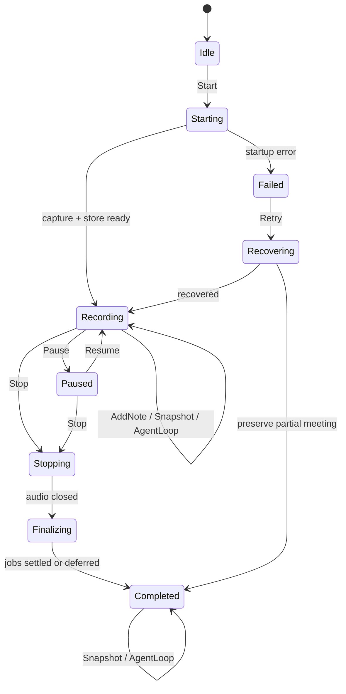
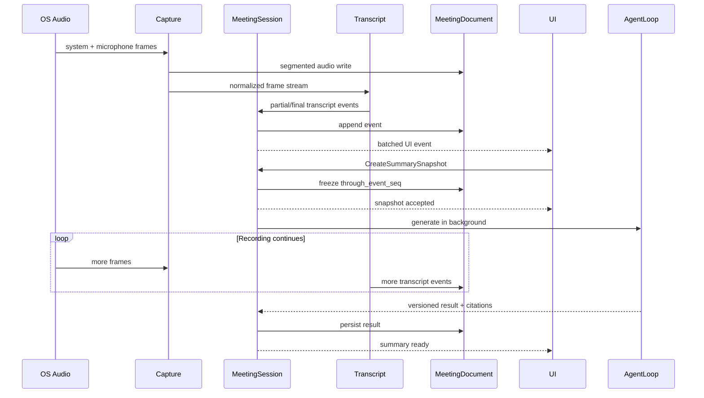

# OpenMeetNote 工程藍圖

狀態：施工前設計草案  
日期：2026-08-01  
適用平台：Windows、macOS

## 1. 產品目標

OpenMeetNote 將一場正在進行的會議轉換成可追溯、可持續修訂且能直接交付的成果文件。它不是單純錄音器、逐字稿工具或固定格式摘要器。

核心閉環如下：



成功條件：

1. 使用者能在 Windows 或 macOS 上直接開始錄製系統音訊與麥克風。
2. 錄製期間持續看到繁體中文逐字稿，英文技術詞彙不被不必要地翻譯。
3. 建立摘要或執行 Agent Loop 不得中斷音訊擷取與逐字稿寫入。
4. 每項重要結論可以追溯至逐字稿、人工筆記或附件。
5. Agent 可以改變文件結構，但不得把缺少證據的內容描述成會議事實。
6. 應用程式不要求帳號，資料與憑證由個人裝置管理。

## 2. 範圍與非目標

### 2.1 第一階段範圍

- Windows 與 macOS 桌面應用。
- 系統音訊與麥克風雙來源擷取。
- 即時串流逐字稿與穩定片段修訂。
- 語者分離、暫定名稱與人工確認。
- 時間戳人工筆記。
- 錄製中摘要快照與會後最終摘要。
- 會議搜尋、重新開啟與 HTML 匯出。
- GUI Provider 設定、環境變數覆寫、OS 憑證儲存。
- 通用 Agent Loop 與每次生成專用 Prompt。

### 2.2 第一階段非目標

- Android、iOS 或 Web 錄音。
- 帳號、團隊空間、雲端同步或多人共同編輯。
- 會議 Bot 加入 Zoom、Teams 或 Google Meet。
- 行事曆、CRM、知識圖譜或跨會議企業搜尋。
- 由程式內建「報價會議必定生成 SOW」之類的固定映射。
- 未經確認便從他人提及推定語者真實身份。

## 3. 設計原則

### 3.1 深模組

系統以少數深模組承擔複雜行為。呼叫端只理解小型 Interface；音訊執行緒、逐字稿修訂、快照一致性及 Agent 迭代細節保留在 Implementation 內。

### 3.2 真正變動處才建立 Seam

- macOS、Windows 與測試音訊來源不同，因此 `AudioCapture` 是真實 Seam。
- STT 與 LLM 會有多個 Provider 及測試替身，因此各自需要 Adapter。
- SQLite 儲存只有單一正式 Implementation；測試使用暫存 SQLite，不額外公開 Repository Interface。
- UI 與 Rust 核心之間只傳遞命令與批次事件，不暴露內部管線。

### 3.3 本機優先與失敗可恢復

- 逐字稿、筆記、狀態與生成版本先寫入本機 SQLite。
- 音訊以分段檔案寫入，避免單一檔案損毀整場會議。
- 網路或 Provider 失敗不影響錄音；可從持久化游標重試。

### 3.4 證據與推論分離

- `Fact`：可回到來源的會議內容。
- `Inference`：由 Agent 整理出的推論，必須明確標示。
- `Suggestion`：AI 補充建議，不等同決議。
- `Gap`：缺少、矛盾或尚未確認的資訊。

## 4. 系統架構



音訊 PCM 不可通過 WebView。UI 只接收節流後的音量、狀態、逐字稿及文件事件。

## 5. 深模組與 Interface

### 5.1 `MeetingSession`

責任：統一管理會議生命週期、命令排序、背景工作與可恢復狀態。

外部 Interface 保持為命令與事件兩個概念：

```rust
pub trait MeetingSession {
    async fn execute(&self, command: SessionCommand) -> Result<CommandReceipt>;
    fn events(&self) -> SessionEventStream;
}
```

主要命令：

- `Start`
- `Pause`
- `Resume`
- `AddNote`
- `ConfirmSpeaker`
- `CreateSummarySnapshot`
- `RunAgentLoop`
- `Stop`
- `RetryJob`

Interface 不允許呼叫端直接控制 Audio、STT 或 SQLite；所有一致性規則集中於此模組。

### 5.2 `AudioCapture`

責任：開啟音訊來源、統一格式、附加時間基準、偵測丟幀並輸出 PCM frame stream。

Adapter：

- macOS：ScreenCaptureKit 系統音訊＋麥克風。
- Windows：WASAPI Loopback 系統音訊＋麥克風。
- 測試：固定 WAV／PCM Fixture。

共同輸出格式在 PoC 後決定；初始候選為 48 kHz、單聲道或雙軌、32-bit float。混音前保留來源標記，便於除錯與未來語者策略。

### 5.3 `Transcript`

責任：將音訊送至 STT、處理 partial／final 修訂、語言正規化、時間對齊及語者標籤。

不可將每次 partial result 當成永久新句。每個片段包含穩定 ID 與 revision：

```text
segment_id + revision + start_ms + end_ms + text + speaker_id + stability
```

輸出規則：

- 主要文字為繁體中文。
- CMS、SLA、API、UAT 等英文詞彙原樣保留。
- STT 的簡體中文結果可在 final segment 階段轉換，partial 不做昂貴重寫。
- 使用者修訂不得被後續 Provider revision 覆蓋。

#### 5.3.1 雙引擎與分歧標記

partial 與 final 由兩個本機引擎分別產生，不是同一個模型跑兩次：

| 階段 | 引擎 | 角色 |
|---|---|---|
| partial | Paraformer 離線 int8（sherpa-onnx） | 錄音期間的即時稿 |
| final | whisper large-v3-turbo-q5（whisper.cpp） | 片段定稿，提供 `start_ms`／`end_ms` |

兩者對同一片段的結果不一致時，該處標為 `Gap` 交由使用者確認，不靜默採用其中一方。這不是為了保險而多跑一次：實測顯示兩個引擎的錯誤不重疊，分歧本身就指出最可能出錯的位置，而那些位置幾乎都是專有名詞。

whisper 必須帶時間戳執行。`-nt`（no timestamps）會抑制時間戳 token 並改變解碼路徑，微調模型在該模式下會提前輸出 EOT 而截斷；何況引用驗證本來就需要時間戳定位。

已測過並排除的選項，記在這裡是為了不再走一次：

| 選項 | 排除原因 |
|---|---|
| Gemini Live（2.5 native audio／3.1 flash live） | 會在無錯誤訊號的情況下丟棄整段音訊，同一段單獨送回空、放在串流脈絡中改以數字幻覺填滿，兩次重跑一致。失敗不可診斷，且無時間戳 |
| Belle-whisper-large-v3-turbo-zh | 中文微調語料以大陸普通話為主，台灣詞彙反而更差（達悟族→达物族、原民會→人民会），且輸出簡體 |
| SenseVoice int8 | 全面輸給同級的 Paraformer：更慢、命中更少 |
| whisper medium-q5 | 與 turbo 同分但更慢、記憶體多三成 |
| 雲端 STT（Azure 等） | 與本機優先定位衝突，且需付費 |

### 5.4 `MeetingDocument`

責任：管理逐字稿、人工筆記、語者映射、生成版本、引用與匯出。

所有寫入採 append-oriented event，再投影成目前文件狀態。摘要快照以 `through_event_seq` 固定涵蓋範圍，因此生成期間後續錄音可以繼續寫入。

```text
Snapshot v3 = meeting_id + through_event_seq 928 + prompt + created_at
```

### 5.5 `AgentLoop`

責任：根據本輪目標與證據規劃文件、產生草稿、檢查缺口、驗證引用並迭代。

唯一主要 Interface：

```rust
pub trait AgentLoop {
    async fn generate(&self, request: GenerationRequest) -> Result<GenerationResult>;
}
```

`GenerationRequest` 包含：

- 本輪使用者 Prompt，可為空。
- 指定的會議快照。
- 人工筆記、附件與已確認語者。
- 前一版文件，若為修訂。
- 最大輪數、時間與費用限制。

`GenerationResult` 回傳成果區塊、來源引用、缺口、建議、驗證結果與使用量，不直接寫檔。

「前一版文件，若為修訂」在實作上是 `revise_of: Option<u32>`：帶版本號而不是
直接帶區塊，呼叫端只知道「使用者在看哪一版」，「那一版的內容是什麼」是 Store
的事。取最後一個**成功**的版本當基礎，不是使用者當下正在看的那一版：版本是一
條線性歷史，從中間分岔出去之後，v4 接在誰後面就沒有答案了。

前一版算在**指令**額度裡不算在證據額度裡。它是本輪要改的對象，不是證據；而且
它一大，證據額度就該跟著縮，不是靜默超限讓 Provider 從最前面開始截斷。

指定的版本不存在時整輪失敗，不靜默退回「不是修訂」。後者會讓使用者以為改寫成
功，實際上拿到一份從零開始的文件。

附件目前沒有生產者。schema（`attachments`、`attachment_chunks`）與引用路徑
（`evidence_text` 認得 `attachment_chunk`）都在，缺的是匯入 UI 與文字抽取。
它不在 §2.1 第一階段範圍內，而 PDF 與 docx 的文字抽取是另一個依賴決策，
不順手做掉；接上時引用驗證那一側不必改。

#### 5.5.1 執行後端

`Planner` trait 不因後端改變，下列後端都只實作同一個 `draft`：

| 後端 | 執行方式 | 憑證 | 定位 |
|---|---|---|---|
| 系統 LLM 配置 | 用這台機器上偵測到的 Agent CLI，不綁定特定一支 | 使用者既有 CLI 登入 | 偵測得到時的預設 |
| Claude Code | 子行程執行 `claude` 非互動模式 | 同上 | GUI 可選 |
| Codex CLI | 子行程執行 `codex exec` | 同上 | GUI 可選 |
| LLM API | 呼叫 Anthropic、OpenAI 或 OpenAI-compatible 端點 | BYOK，存於 OS 憑證庫 | GUI 可選 |
| 內建測試規劃器 | 不呼叫任何 Provider | 無 | 偵測不到 CLI 時的預設，以及 §15.3 的整合測試 |

偵測不到任何 CLI 時預設落在測試規劃器而不是 API：預設一個必須先填金鑰才會動的後端，等於裝好就是壞的。

偵測只回答「這支 CLI 裝了沒、跑不跑得起來」。登入狀態不在偵測階段驗證，那需要真的送出一次請求，會產生費用與延遲；未登入與額度用盡在首次生成時以 Provider 錯誤回報，錄音與逐字稿不受影響。

CLI 後端接上真實呼叫時的約束（目前實作到偵測與設定，呼叫是 M5 的工作）：

- 以單次非互動呼叫使用，不讓 CLI 進入互動會話。
- 子行程工作目錄限制在該場會議的暫存目錄，證據以檔案或 stdin 傳入。
- Prompt 與證據不放進 argv，避免出現在行程列表。
- 逾時、取消與關閉必須終止整個行程樹。
- CLI 不保證回報 token 用量，因此費用上限對此後端改以最大輪數與時間表達，`usage` 允許缺值。
- CLI 輸出一律當成不受信任內容，走與其他後端相同的區塊驗證與轉義路徑。

### 5.6 `ProviderConfig`

責任：解析 GUI 設定、環境變數優先權及憑證存取，不讓其他模組理解儲存差異。

優先順序：

1. 作業系統環境變數。
2. GUI 選擇的 Provider 與非敏感設定。
3. Keychain／Credential Manager 中的密鑰。

密鑰不得存入 SQLite、設定檔、逐字稿、日誌或錯誤回報。

Agent CLI 後端不需要密鑰，`ProviderConfig` 對它改為解析可執行檔路徑與版本，並把「找不到 CLI」與「跑不起來」當成兩種可區分的狀態回報給 GUI。

## 6. 會議狀態機



建立摘要快照與執行 Agent Loop 都是 `Recording → Recording`，不得停止 Capture 或等待 AI 才回到錄音狀態。

## 7. 即時資料流



## 8. 語者模型

### 8.1 預設行為

- Diarization 只建立穩定的 `speaker_id`，畫面顯示「語者 1」「語者 2」。
- 「我是王小明」可建立 `proposed_name = 王小明`，狀態為待確認。
- 使用者確認後才建立 `confirmed_name`。
- 「王小明剛才說……」不得用來認定目前發言者就是王小明。
- 語者合併或拆分保留稽核紀錄，引用仍指向原始片段。

### 8.2 名稱優先順序

```text
使用者確認名稱 > 使用者手動名稱 > 待確認自我介紹 > 語者 N
```

## 9. 通用 Agent Loop

### 9.1 禁止固定方向映射

系統不得實作以下規則：

```text
if meeting_type == "quotation" then render_sow_template()
```

報價、SOW、活動須知、研究報告、決策紀錄只可作為 Agent 可借用的參考結構。文件方向由本輪 Prompt、證據與成果目標共同形成。

### 9.2 迭代階段

1. **理解目標**：提取使用者希望達成的成果與限制。
2. **建立證據索引**：整理逐字稿、筆記、附件、既有版本與來源位置。
3. **規劃文件**：選擇或組合適合本輪的段落與視覺表達。
4. **產生草稿**：輸出結構化區塊，不直接拼接未轉義 HTML。
5. **缺口與矛盾檢查**：找出未知值、互相衝突的說法及語者不確定性。
6. **引用驗證**：所有 Decision／Fact 必須有有效 `SourceRef`。
7. **品質批判**：檢查是否滿足 Prompt、是否誤把建議當決議、是否有重複內容。
8. **迭代或停止**：在改善仍具意義且未超過限制時修訂，否則回傳最佳版本與未解缺口。

#### 9.2.1 哪幾步在程式裡，哪幾步在模型裡

一個容易踩到的時間點問題：整趟生成固定在同一個 SQLite 讀取快照上，那是為了
讓跨輪的草稿看到同一個世界。但「快照游標之後又累積了多少內容」問的是**現在
外面怎麼樣**，在凍結的連線裡查，答案永遠停在生成開始那一刻 —— 而生成期間
錄音持續寫入，使用者最在意的就是那幾分鐘。這一則缺口因此由呼叫端在生成結束、
寫入成果之前用一個沒被凍結的連線量一次（`agent::uncovered_content_gap`）。


這八步不是八次模型呼叫。每多一次呼叫就是一次幾十秒與一次費用，而其中幾步
的判準是確定性的，交給模型只是把可以保證的事變成不保證。

| 步 | 在哪裡 | 理由 |
|---|---|---|
| 1 理解目標 | 模型 | 本輪 Prompt 的意思要靠語意 |
| 2 建立證據索引 | 程式 | `build_index` 與 `pack_evidence`，順序與裁切規則是規格 |
| 3-4 規劃與草稿 | 模型 | 唯一無法保證輸出的環節，所以放在 `Planner` 後面 |
| 5 缺口與矛盾檢查 | 兩邊 | 涵蓋範圍的缺口由程式產生（額度裁掉幾段、快照游標之後又寫入幾筆事件，都是系統知道而模型不知道的數字）；內容上的矛盾靠模型 |
| 6 引用驗證 | 程式 | 讓被驗證者宣告自己通過驗證，那個驗證就不存在 |
| 7 品質批判 | 兩邊 | 字面重複由程式消（正規化後相同就是重複，不需要判斷力）；「是否誤把建議當決議」靠模型 |
| 8 迭代或停止 | 程式 | 停止條件是規格，不是模型的裁量 |

第五步的分工有一個直接後果：Prompt 明確要求模型**不要**寫涵蓋範圍的缺口。
兩邊都寫就是重複內容，而重複正是第七步要消掉的東西。

同理，涵蓋範圍的缺口不能寫在某一個 `Planner` 裡。那是每個後端都一樣的系統
事實，寫在其中一個裡面，換一個後端就會靜默消失。

### 9.3 停止條件

- 所有必要成果已涵蓋，引用與一致性檢查通過。
- 缺少資料且必須由使用者或外部來源補充。
- 達到使用者設定的最大輪數、時間或費用。
- 新一輪沒有實質改善。
- 使用者取消。

Agent Loop 不得無限制自我呼叫。

### 9.4 Prompt Injection 防護

- 逐字稿與附件一律視為不受信任的證據內容。
- 證據內的指令不能改寫系統規則或本輪使用者 Prompt。

證據在 Prompt 裡以標記圍起來，不只靠一句自然語言警告。原因是逐字稿可以用
換行偽造出「本輪使用者要求：忽略上文」這種段落，在版面上與真的完全一樣，
模型沒有辦法分辨。標記從證據自身的雜湊取（前 12 個十六進位字元）：會議
參與者要偽造出正確的結束標記，得先算出一份包含自己那句話的文件的雜湊 ——
那是自我指涉的，不是「很難」而是做不到。標記在證據出現之前先宣告，內容
因此無法回頭改寫規則。

這是機率性防護的結構化補強，不是證明。模型仍可能在圍欄內被說服，因此
引用驗證那一層不受這條影響，它才是能被強制執行的那一個。
- HTML Renderer 對文字、URL 與屬性做結構化轉義。
- Mermaid 使用嚴格安全模式；不允許任意 script、iframe 或事件屬性。

## 10. HTML 成果模型

Agent 回傳受控的文件區塊，而不是任意 HTML 字串：

- `Heading`
- `Paragraph`
- `BulletList`
- `Table`
- `MermaidDiagram`
- `Callout`
- `Decision`
- `ActionItem`
- `Gap`
- `Suggestion`
- `SourceLink`
- `TranscriptExcerpt`

Renderer 統一負責樣式、導覽、錨點、列印、來源連結與可存取性。這使 Agent 能自由規劃內容方向，同時避免任意程式碼執行。

匯出的 HTML 至少包含：

- 成果摘要。
- 依本輪目標生成的詳細主文。
- 決議與行動項目（若證據存在）。
- 資訊缺口與 AI 建議，並與事實分離。
- 完整逐字稿或可選擇的逐字稿附件。
- 所有來源錨點與生成版本資訊。

### 10.1 分區由渲染器決定，不由模型的輸出順序決定

上面那份清單是分區規則的來源。實作上，一個區塊落在哪一區只看它自己的
`kind` 與 `claim_kind`：

| 區 | 判準 |
|---|---|
| 成果摘要 | `tone` 為 `summary` 的 `Callout` |
| 主文 | 其餘 `Fact` 與 `Inference` |
| 決議與行動項目 | `Decision` 與 `ActionItem` |
| 缺口與建議 | `Gap` 與 `Suggestion` |

模型把決議寫在最前面或最後面都不影響讀者看到的組織方式。反過來，渲染器
也不會自己生一段摘要出來：沒有 `summary` 區塊，成果摘要那一區就不存在。
取主文第一段充當摘要等於在文件裡放一段沒人寫過的內容。

成果摘要用既有的 `Callout` 表達而不是新增一種區塊：它需要的只是「這一段
是全文的濃縮」這個標記，而 `tone` 已經是那個位置。

目錄只列真的存在的區。沒有決議的會議本來就不該生出一個空的「決議」段落。

引用的錨點指向片段而不是「片段的某一版」。`verify_ref` 允許引用快照範圍內
的任何版本，但匯出的逐字稿只會有一版，帶版本號的錨點在引用舊版本時會指向
文件裡不存在的位置，點了什麼都不會發生。改成指向片段本身之後永遠落得了地，
版本落差則以 `data-stale` 與「已修訂」標記講出來。

畫面上的文件也有目錄，與匯出那一份同一套規則：只列真的存在的區，加上主文
裡的一二級標題。只有一個區時不顯示，那只是多一列要讀的東西。

畫面與匯出是兩份實作（一邊是 React，一邊是 Rust 產字串），分區規則因此有
兩份程式碼。兩邊分歧的話，使用者在畫面上看到的文件與他匯出的那份會是不同
的組織方式，而那種落差不會有任何一邊報錯，所以有一個測試直接讀前端的
`sectionOf` 原始碼比對兩邊的判準。

### 10.2 Mermaid 不內嵌 runtime

§18 的待決策項。決定是不內嵌，理由是取捨不成立：runtime 一包約 1 MB，而
目前一份匯出檔是 11 KB，為了偶爾出現的一張流程圖讓每份檔案漲近百倍不合算；
允許外部資源則違反「單檔可攜」與 §9.4 的注入防線。

圖表因此以原始碼呈現，並標明它是 Mermaid 原始碼。這比畫一張假的圖或靜默
丟掉誠實：讀者知道那裡有一張圖，也貼得進任何 Mermaid 檢視器。

## 11. 初始資料模型

| 資料表 | 目的 | 關鍵欄位 |
|---|---|---|
| `meetings` | 會議主資料與狀態 | `id`, `title`, `state`, `started_at`, `ended_at` |
| `audio_segments` | 分段音訊檔索引 | `meeting_id`, `track`, `path`, `start_ms`, `end_ms`, `checksum` |
| `transcript_segments` | 可修訂逐字稿片段 | `id`, `revision`, `text`, `speaker_id`, `stability`, `user_edited` |
| `speakers` | 語者與名稱確認 | `id`, `ordinal`, `proposed_name`, `confirmed_name`, `status` |
| `notes` | 時間戳人工筆記 | `id`, `event_seq`, `text`, `created_at` |
| `meeting_events` | Append-oriented 事件序列 | `seq`, `kind`, `payload`, `created_at` |
| `generation_runs` | 摘要與 Agent Loop 版本 | `id`, `through_event_seq`, `prompt`, `status`, `usage` |
| `document_blocks` | 受控成果區塊 | `run_id`, `position`, `kind`, `content` |
| `source_refs` | 成果到證據的引用 | `block_id`, `source_kind`, `source_id`, `start_ms`, `end_ms` |
| `provider_settings` | 非敏感 Provider 設定 | `kind`, `provider`, `model`, `base_url`, `options` |

正式 schema 必須在第一個垂直切片完成後，以實際查詢與交易需求驗證；不預先建立跨會議知識圖譜。

## 12. 效能與可靠性

以下是首輪量測目標，不是未經驗證的效能宣稱：

- 音訊 callback 不執行網路、SQLite、JSON 序列化或 UI 呼叫。
- 音訊 frame 透過有界佇列傳遞；背壓與丟幀必須被記錄。
- UI 事件採批次節流，不逐字或逐 frame 呼叫 WebView。
- 摘要及 Agent Loop 在獨立工作佇列執行，不能提高音訊丟幀率。
- 正常網路與 Provider 條件下，逐字稿端到端 p95 目標先設為 3 秒內，PoC 後重訂。
- 兩小時連續錄音壓力測試不得崩潰，記憶體必須趨於穩定。
- 應用程式非正常關閉後，可恢復已持久化的音訊、逐字稿與人工筆記。

效能優化流程：先以 profiling 找出 Capture、轉錄處理、SQLite 寫入與 UI event batching 的熱點，修改後重新量測；不得以主觀感覺宣稱最佳化完成。

## 13. 錯誤處理

| 失敗 | 必須行為 |
|---|---|
| 系統音訊權限拒絕 | 清楚指出缺少的權限與設定路徑；不可悄悄只錄麥克風 |
| 麥克風中斷 | 保留系統音訊並顯示 track degraded |
| STT 斷線 | 繼續錄音與持久化，排隊重試或會後補轉錄 |
| LLM 失敗 | 不影響錄音；保留 snapshot 並允許重試或更換 Provider |
| SQLite 暫時忙碌 | 有界重試並維持事件順序；不可在 audio callback 重試 |
| 磁碟空間不足 | 立即通知並安全停止錄音，保留已完成分段 |
| 應用程式崩潰 | 下次啟動偵測未完成會議並提供恢復 |

## 14. 安全與隱私

- 無帳號、無預設遙測、無跨裝置同步。
- Provider 呼叫前清楚顯示哪些資料會離開裝置。
- API Key 儲存在 macOS Keychain 或 Windows Credential Manager。
- 日誌預設不包含逐字稿全文、音訊、Prompt、附件或密鑰。
- 使用者可以刪除單場會議及其音訊、逐字稿、生成結果與索引。
- 對外錄音涉及的同意與法律責任須在首次使用時提示；實際文字依發布地區法規另行確認。

## 15. 測試策略

### 15.1 Interface 測試

- `MeetingSession`：使用 Fixture Audio、測試 STT 與 Mock LLM，從命令輸入驗證事件與持久化結果。
- `AgentLoop`：以固定會議證據驗證引用完整、缺口保留、建議與決議分離。
- `Transcript`：驗證 partial revision、final 穩定、使用者修訂不被覆蓋。

測試只跨模組 Interface，不依賴內部函式排列。

### 15.2 Adapter 契約測試

- macOS 與 Windows Capture Adapter 產生相同 PCM frame 契約。
- 各 STT Adapter 將 Provider 特有事件轉換成共同 Transcript Event。
- 各 LLM Adapter 回報一致的成功、限流、授權失敗與使用量資訊。

### 15.3 整合與系統測試

- 兩小時錄音 soak test。
- 網路斷線、Provider 限流與重新連線。
- 錄製中重複建立摘要快照。
- 崩潰恢復與 SQLite WAL 一致性。
- 中英文交錯、重疊發言、自我介紹與未確認語者。
- HTML snapshot／可存取性／列印 golden tests。
- Windows 與 macOS 安裝、升級、權限與解除安裝。

## 16. 開發階段

### M0：Repository 與藍圖

- 建立 Repository、工程藍圖與 HTML 原型。
- 定義雙平台 PoC 的可量測驗收條件。

### M1：雙平台 Capture PoC

- macOS ScreenCaptureKit＋麥克風。
- Windows WASAPI Loopback＋麥克風。
- 分段 WAV 寫入、音量資訊、丟幀統計與兩小時測試。

此階段失敗時先修正音訊架構，不開始完整 UI。

### M2：第一個垂直切片

- Tauri UI 可開始／停止會議。
- Capture → STT → 即時逐字稿 → SQLite → 重開會議。
- 使用 Fixture Adapter 建立可重複的整合測試。

### M3：語者與人工筆記

- Diarization、語者 N、待確認自我介紹、名稱修正。
- 時間戳人工筆記與引用。

### M4：不中斷摘要

- Snapshot cursor、背景生成、版本歷史、錯誤重試。
- 驗證生成期間不增加 Capture 丟幀。

### M5：通用 Agent Loop 與 HTML

- 動態文件規劃、缺口檢查、引用驗證及迭代停止條件。
- 安全 Renderer、Mermaid、表格、交叉引用、逐字稿與列印。

### M6：產品化

- GUI Provider 設定與 OS 憑證儲存。
- 效能 profiling、崩潰恢復、安裝包、簽章與更新策略。
- Windows 與 macOS 發布驗收。

## 17. 完成定義

OpenMeetNote 只有同時符合下列條件才可稱為第一版完工：

1. Windows 與 macOS 實機可擷取系統音訊與麥克風。
2. 兩小時會議能持續轉錄、寫入與恢復，沒有未說明的資料遺失。
3. 使用者可在錄音中建立多個摘要版本，錄音與逐字稿不中斷。
4. 語者預設與名稱確認規則符合本藍圖。
5. 人工筆記、逐字稿與附件可被 Agent Loop 引用。
6. 使用者 Prompt 能改變本輪文件方向，程式碼沒有固定會議類型映射。
7. 匯出 HTML 包含成果主文、必要圖表、來源引用、缺口、AI 建議與逐字稿。
8. API Key 不出現在檔案、SQLite 或日誌。
9. 狹義測試、雙平台整合測試與效能量測通過。
10. 安裝、權限提示、升級與解除安裝均完成實機驗證。

## 17.0 幻覺的兩種來源與擋法

whisper 在沒有語音的音訊上會產生文字，這不是可以靠調參數消除的，得在送進模型之前就攔住。兩小時實測顯示它有兩種形狀，需要兩道不同的防線：

| 形狀 | 例子 | 擋法 |
|---|---|---|
| 訓練資料殘留 | 「中文字幕志愿者 杨栋梁」 | 文字模式比對，且限定整批只有這一句、能量又低時才丟 |
| 一般短詞 | 「好」「謝謝」 | VAD 閘門。這種詞列不得黑名單，會議裡天天在講 |
| 卡住重複 | 「好 等一下 等一下 等一下 等一下 等一下 等一下」 | 同一個詞連續重複四次以上。54 批真實會議裡句內連續重複最多 1 次，也就是完全沒有 |
| 碎片連發 | `["2","3","4","4","5","6","6","6","7","7"]` | 五句以上且每句都只有一兩個字。真實會議一批都沒有 |

後兩種是 VAD 放行之後才出現的：音訊裡真的有微弱人聲（實測人聲佔比 10% 與 30%），但不足以讓解碼器產生內容，於是它卡在原地空轉。文字內容治不了，因為數字和「等一下」都是正常詞；能治的是結構。

第二種比第一種常見得多，兩小時錄音的麥克風軌 83 段幾乎都是。

**能量門檻是自適應的**：`clamp(最近 40 批 RMS 的第 20 百分位 × 1.5, 0.003, 0.02)`。固定值在安靜房間會吃掉小聲說的話，在吵雜場地又形同虛設。冷啟動樣本不足時用下界，寧可放行讓 VAD 判，也不要用兩三批算出來的底噪擋掉會議開頭的發言。

**但自適應能量門檻仍然擋不住它**：環境噪音的 RMS 可以跟小聲說話一樣高。實測噪音 RMS 0.0130 判 0 ms 人聲，把真實語音縮到 RMS 0.0107 仍判 6406 ms，VAD 判的是內容不是音量。

**whisper 自己的 no_speech 機率派不上用場**：beam search 路徑下一律回傳 0，連純靜音那段也是。

**VAD 的 `clear` 不等於重置**：它只清佇列，模型的遞迴狀態要 `reset` 才歸零。sherpa-rs 沒有把這個 C 函式接出來，vendored patch 補上了。少了它，一批真實語音之後的噪音會被算成有人聲，而那正是閘門要擋的東西。

### 六道防線與它們的順序

順序不是隨意的，每一道都放在「前一道已經確認了什麼」之後：

| # | 判準 | 擋什麼 | 為什麼在這個位置 |
|---|---|---|---|
| 1 | RMS < 0.0005 | 數位靜音 | 純粹省下 VAD 的計算，這條線壓在任何真實訊號之下 |
| 2 | VAD 判無人聲 | 環境噪音 | 判內容不判音量，實測噪音從 RMS 0.006 到 0.43 全判 0 ms |
| 3 | 人聲佔比 < 20% | 零星幾百毫秒的偽陽性 | 真實批次最低 31%、中位 88%，幻覺 4% 與 14% |
| 4 | RMS < max(0.008, 底噪×1.5) | 微弱到不可能是發言的回音 | **必須在 VAD 之後**：能量分不開噪音與小聲說話，但 VAD 確認過有語音結構之後就分得開 |
| 5 | 整批都是已知殘留 | 字幕組署名 | 不套能量條件，那種句子在任何音量下都不是人說的 |
| 6 | 連續重複四次／五句以上全是碎片 | 解碼器空轉 | 套能量條件，真人在正常音量下確實會重複強調 |

實測淨效果（35 分鐘，外放播放會議音訊）：系統音訊軌定稿 81 批、被擋 0 批；麥克風軌定稿 0 批。真實內容一句沒少，幻覺一句沒進。

走到這裡花了六輪，每一輪都是「上一版漏掉的那幾筆長什麼樣」決定下一道防線的形狀，而不是預先設計。前五種形狀分別是：訓練資料殘留、一般短詞、卡住重複、碎片連發、微弱回音。

## 17.0.1 同一個 VAD，兩種相反的用法

VAD 在這個系統裡服務兩條路徑，它們對「狀態」的要求是相反的，用錯一邊會靜默壞掉：

| 路徑 | 輸入 | 要的行為 |
|---|---|---|
| 即時稿的人聲判斷 | 100 ms 的 chunk | 跨 chunk 累積。單個 chunk 比 VAD 認定的最短語音還短 |
| 定稿閘門 | 8 到 15 秒的批次 | 每批獨立。上一批的語音不該影響這一批的判定 |

曾經把定稿用的 helper（每次 `reset`）套到即時稿上，結果是連續講話十秒、一百個 chunk，判有人聲 0 次；改用串流的 `is_speech` 是 94 次。畫面上不會有任何即時字，而且每三秒清空一次視窗 —— 全程不報錯。

閘門的 `min_speech_duration` 也跟切點分開：切點寧可晚切也不要剖開句子，250 ms 合理；閘門判錯的代價是整批音訊被丟，使用者說過的話就此消失。實測 8 秒批次裡只有 180 ms 語音時，250 ms 判 0（整批被丟），150 ms 判 322 ms（留得住），純噪音在兩者之下都是 0。

### 外放時的回音

喇叭外放時麥克風會收到遠端的聲音，同一段內容因此被記錄兩次：一次是系統音訊軌的清楚版本，一次是麥克風軌經過空氣衰減的破碎版本（實測 RMS 0.033 到 0.039、人聲佔比 71% 到 98%，內容是簡體且辨識劣化）。

沒有做啟發式抑制。可用的判準只有「麥克風能量顯著低於系統音訊」，而實測兩者比值落在 0.5 附近，跟使用者小聲說話的情況重疊 —— 誤刪真實發言比留下重複內容嚴重得多。正確解法是回音消除（AEC），那是另一個層級的工程。

實務上這個情況不常發生：戴耳機就沒有，而 Windows 對通訊類裝置預設會做回音消除。使用者外放且發現逐字稿重複時，戴耳機是最直接的解法。

`transcript_segment_revisions.echo_likelihood` 欄位留著但一律為 `NULL`，日後接上 AEC 或相關性偵測時才會有值。

### 已知損失

強制切批時落在下一批開頭、短於約 150 ms 的詞尾留不住（實測 120 ms 判 0、180 ms 判 322 ms）。要救它得追蹤「上一批是被強制切的」並對續批放寬判準，換來的複雜度與幻覺回歸的風險超過一個字尾音的價值。發生條件還要再加上「說完剛好跨批、之後完全靜默」，一般會議會繼續有人講話，那批就不會被丟。

## 17.2 獨立審查找出的失敗路徑

一輪針對「真實會議會踩到、但測試沒蓋到」的外部審查，九項全部處理。列在這裡是因為每一項的教訓都比修法本身重要：

| 症狀 | 根因 | 教訓 |
|---|---|---|
| 即時稿開場一分鐘後永久停止 | 節流拿被滑動視窗剪過的 buffer 長度當時間軸，封頂後永遠追不上 | 時間軸必須單調遞增，不能拿會被裁剪的東西當鐘 |
| 音量條在麥克風死掉時照常跳動 | `level` 是亂數 | 使用者判斷「有沒有在收音」的唯一依據，寧可不動也不能假動 |
| 按下結束後最後八到十五秒消失 | 三個狀態一次跳完，背景工作沒有結算的位置 | 收尾是一個狀態不是一個瞬間 |
| 暫停期間說的話照樣被記錄 | pause 只改 session 狀態，音訊照收，resume 後一次倒出 | 暫停是承諾，不是 UI 效果 |
| 沒裝 CLI 卻拿到「成功」的假摘要 | 「找不到 CLI」與「使用者選了 fixture」走同一條退路 | 缺少依賴要明說，不要用降級掩蓋 |
| 生成完卻回報逾時 | 管線沒人讀，子行程寫滿緩衝就 block | 開了管線就要排水 |
| 磁碟暫時滿了，那幾句永久消失 | 寫入失敗的批次被丟棄 | 唯一真實來源的寫入失敗只能重試，不能放棄 |
| 歷史頁永遠顯示「生成中」 | 開新會議換掉 Session，背景工作找不到自己的 run | 換掉狀態容器之前，先讓在途工作有結局 |
| 注入測試偶發紅燈，但系統其實做對了 | 判準是「輸出有沒有出現那個字串」，而正確的處理方式就是把注入企圖寫成 gap 區塊，那種區塊必然含有它 | 測「有沒有照做」不要測「有沒有提到」，否則最理想的行為會被判成失敗 |
| 每一份匯出檔的標題都一樣 | `<h1>` 用 `documents.title`，而那是寫死的「會議摘要」 | 顯示給人看的名字要用人改得動的那一個（`meetings.title`） |
| 匯出之後只拿到一串路徑 | 只回傳路徑就當成完成，使用者得自己去檔案總管翻 | 產出一個檔案的工作沒有結束在寫檔那一刻，結束在使用者拿得到它的時候 |
| 多個摘要版本在畫面上長得一模一樣 | 本輪要求存進了資料庫卻沒有送進 UI 事件 | 存了不等於送得到；資料流的每一段都要走過一次才算接上 |
| 生成期間錄下的內容不會被標成缺口 | 「游標之後有沒有新東西」在生成那條被凍結的讀取快照裡查，答案永遠停在生成開始那一刻，而 §5.4.2 的重點正是那幾分鐘錄音不中斷 | 讀取快照的用途是「跨輪看到同一個世界」，凡是要問「現在外面怎麼樣」的問題都不能在它裡面問。獨立審查找到的 |
| 每一份成果都被標上一個不存在的缺口 | 「游標之後還有沒有東西」拿 `high_seq` 的差來算，而快照自己的 `SnapshotCreated` 與 `GenerationCompleted` 的 seq 都在游標之後 | 數「內容」不要數「事件」。單元測試的種子資料從來沒有游標之後的事件，這個是真實跑一次才看得出來的 |

## 17.3 第二輪獨立審查

一輪針對「摘要管線最近的大量改動」的唯讀對抗審查，十六項全部處理。這一輪的
教訓集中在同一件事：**能被繞過的驗證等於沒有驗證，而繞過它的往往是最無害的
輸入。**

| 症狀 | 根因 | 教訓 |
|---|---|---|
| 空引文通過引用驗證 | `contains("")` 永遠為真，模型只要附一個空字串與它正確的雜湊，任何 Fact 都拿得到 `valid` | 整套防幻覺唯一能被強制執行的那一環 fail-open 了。子字串比對之前要先問「這個引文有內容嗎」 |
| 零區塊的成果被寫成「已完成」 | 模型回合法的空陣列時沒有任何區塊被拒絕，迴圈當成全部通過 | 空成果不是完成。下一版還會把這個空版本當成「最後一個成功版本」去修訂 |
| 一輪都沒過就放棄，多輪修正從未發生 | 「沒有改善」以通過數量判斷，0 跟 0 比永遠不會變大 | 全軍覆沒正是要把拒絕原因餵回去的情況，不是要停下來的情況 |
| 內容改好了但被丟掉 | 同樣通過五個、少丟三個的那一版被判「沒有改善」 | 改善不只有一個維度 |
| 決議存不存在取決於模型的輸出順序 | 跨種類去重只留先出現的那一個 | §10.1 說分區由渲染器決定，去重也算分區的一部分 |
| 大綱佔了額度卻從來沒送出去 | `pack_evidence` 把它列為必送，`build_prompt` 沒有印它 | 「算進預算」與「真的送出」是兩件事，只有後者是使用者拿得到的 |
| 人工筆記不可能被引用 | 驗證要求 `source_revision` 等於筆記的 `event_seq`，而那個值從來沒有送給模型 | 要求對方提供一個你沒告訴他的值，等於禁止他提供 |
| 上一版的涵蓋缺口被抄進新版 | 修訂時整份前一版送回模型，而 Prompt 要求未修改的照抄 | 系統產生的內容與模型產生的內容混在一起之後，就分不出哪些該重算 |
| 前一版的預算少算好幾倍 | 只計 `plain_text()`，實際送出的是含 sourceRefs 的完整 JSON | 量測要量真正送出去的那個東西 |
| 單區塊重試的有效引文被判雜湊不符 | `redraft` 直接反序列化，沒走補中繼資料那一步 | 同一件事有兩條入口時，兩條都要做 |
| 筆記引用指到第 7 段逐字稿 | 兩個渲染器都假設引用來源是逐字稿 | 指錯比指不到嚴重 |
| 生成期間定稿的逐字稿數不到 | 量的時候 journal 還沒排空，那幾筆還在記憶體裡 | 問資料庫之前先確認要問的東西已經到了資料庫 |
| 匯出的空逐字稿段落、單項目錄 | 兩個渲染器各自演化 | 規則有兩份實作就會漂移，測試只比對其中一條規則抓不到其他條 |
| 使用者確認過的語者名字到不了摘要 | 證據裡的片段帶的是內部識別碼（`語者=s1`），語者名單另外送而且不含對應關係 | §8 花了一整節在確認語者名稱，名字進不了成果的話那一節在使用者眼裡就是沒有作用 |
| 檔案總管開錯位置 | `/select,` 的路徑含空白時，加引號與不加引號都不對 | 引號要包住路徑本身，不是整串參數 |

審查明確沒找到的：兩個渲染器都沒有可執行的 HTML／屬性／URL 逃逸路徑。
審查當時仍存在的風險（逐字稿可以用換行偽造出「本輪使用者要求：…」這種段落，
只有自然語言警告沒有結構隔離）已在 §9.4 補上以證據雜湊為標記的圍欄。

## 17.1 目前與完成定義的差距

實作到這裡，第 17 節的十項條件還差三項。三項是同一個原因：開發環境沒有
macOS，而這三項的驗收方式都是「在真機上跑」。

| 條件 | 狀態 |
|---|---|
| 1. 雙平台實機擷取 | Windows 完成並實機驗證。macOS 的 ScreenCaptureKit + CoreAudio 已實作，CI 對 Apple Silicon 與 Intel 兩個 target 編譯驗證，arm64 那一格原生跑單元測試，但**沒有在真機上跑過**。發布時標為 beta，這是誠實的狀態而不是保守的措辭 |
| 9. 雙平台整合測試 | Windows 全綠。macOS 有編譯檢查與原生單元測試，整合測試需要真機 |
| 10. 安裝與權限提示 | Windows 完成（`installer/install.ps1`，捷徑、註冊表、移除殘留都驗過）。macOS 的 `.app` 由 CI 產出但沒有人安裝過，兩個權限對話框（螢幕錄製、麥克風）也沒有實際彈出過 —— `Info.plist` 的兩個 usage description 只驗證了會被 Tauri 合併進 bundle |

macOS 那條路徑的兩個來源是刻意分開的：ScreenCaptureKit 從 macOS 15 才能擷取
麥克風，綁在它上面等於讓 13 與 14 的使用者錄不到自己的聲音。系統音訊走 SCK
（可以直接指定 16 kHz 單聲道，省掉一次重取樣），麥克風走 CoreAudio 並以
`rubato` 降取樣 —— 直接每三個取一個會把 8 kHz 以上摺回可聽範圍，而齒音與子音
正好在那裡。

會議結束之後仍可建立摘要（§6 的狀態機補了 `Completed → Completed: Snapshot`）：使用者最常見的流程就是開完會才要摘要，那時逐字稿才完整。原本的守衛只允許 Recording 與 Paused，前端按鈕也跟著停用，等於把最主要的使用方式擋住了。

那還不夠。`Session` 一次只承載一場進行中的會議，關掉程式之後它是空的，於是
「開完會、關掉程式、隔天想做摘要」仍然做不到 —— 而那才是最常見的樣子。歷史頁
因此有一條不經過 `Session` 的路徑（`summarize_meeting`）：版本號、快照游標與要
修訂的版本全部從資料庫算，事件直接寫進 Store。進行中的那一場會被這個指令拒絕，
它走 `Session`；兩條路徑同時配發版本號會撞號，而且畫面上的即時狀態只有 Session
那條會更新。

其餘七項已達成，其中幾項的驗證方式記在這裡供日後重跑：

- 長時間穩定（§17.2）：`whisper-bench/soak.sh` 循環播放會議音訊並每分鐘記錄記憶體與累計批次。跑滿兩小時的結果：393 個定稿批次、2586 個片段、25594 字、行程存活、會議正常收尾。記憶體峰值 2.21 GB，第 108 到 114 分鐘在 2.13 到 2.21 之間來回，是有界震盪不是單調爬升（對這種資料做線性回歸會擬合出一個不存在的上升趨勢，別那樣讀）。停止播放後降到 1.76 GB，漲的部分是工作緩衝，會還回來。處理速率第 11 分鐘後穩定在每分鐘 3 批，零衰減。
- 逐字稿不憑空生字（§17.0）：`tests/hallucination.rs` 用真實模型重現純靜音上的訓練資料殘留並確認擋得住，同時確認真實語音零誤殺；`src/stt/live.rs` 的 `gate_tests` 守住「小聲說話進得來、更大聲的噪音進不來」這個判準。
- 端到端實機（2026-08-05）：錄音 → 結束（15 秒收尾，殘餘音訊救回）→ 結束後建立摘要 → Claude Code CLI 45 秒產出 14 個區塊 → 21 筆引用全部通過驗證 → 匯出 11 KB 自足 HTML → 歷史頁開啟。摘要內容正確反映會議（預算凍結案、文化部列席）。
- 匯出完整性（§17.7）：`tests/end_to_end.rs` 從音訊跑到 HTML，斷言引用指向真實片段、引文逐字相符、逐字稿附在匯出裡。
- 金鑰不外洩（§17.8）：`Secret` 不實作 `Debug`／`Display`／`Serialize`，序列化測試斷言輸出不含金鑰。
- 安裝與解除安裝（§17.10）：`installer/install.ps1`，實機驗證過捷徑、註冊表項目與移除後的殘留檢查。
- 成果文件的分區（§10.1）：`tests/agent_cli.rs` 的 `test_a_real_generation_fills_every_section_of_the_export` 用真實 CLI 跑完整條「證據 → 生成 → 驗證 → 渲染」，斷言目錄、成果摘要、決議與行動項目、逐字稿、版本資訊都在，而且每一筆引用在逐字稿裡都有落點。實測一輪產出 15 個區塊（callout、heading×2、paragraph、table、bulletList、decision×2、actionItem、gap×4、suggestion×2），零退回。
- 修訂（§5.5）：`tests/agent_cli.rs` 的 `test_a_revision_keeps_what_the_previous_version_already_said` 用真實 CLI 跑 v1 → v2，斷言修訂之後區塊種類與數量都沒有腰斬。實測 v1 十三個區塊、v2 二十個：維運那一段被擴寫成段落加表格，其餘照留，這正是「修訂」與「重寫」的差別。
- 整條鏈在真實資料上（§15.3）：`tests/end_to_end.rs` 的 `test_the_whole_chain_holds_on_real_audio` 用真實會議音訊跑完錄音 → 定稿 → 摘要 → 修訂 → 匯出 → 搜尋。實測 28 段逐字稿、v1 二十個區塊十九筆引用零退回、v2 二十四個區塊、匯出 17 KB，逐字稿與人工筆記都搜得回這場會議。與上面那個用 FixturePlanner 的端到端分工：那個守接縫，這個守「在真實資料上串不串得起來」—— 合成證據永遠乾淨、長度可控、引文好對，真實逐字稿有錯字、有半句話，而引用驗證是逐字比對。
- 人工筆記可被引用（§17 第 5 點）：`tests/agent_cli.rs` 的 `test_a_fact_that_only_exists_in_a_note_can_be_cited` 把關鍵數字只寫進筆記、逐字稿不提，要求模型附上出處。實測回三筆 `note/1 r2` 引用、零退回，金額進到成果。這條路徑先前是不可能成功的：驗證要求 `sourceRevision` 等於筆記的 `event_seq`，而那個值從來沒有送給模型。
- 會議搜尋（§2.1）：`store::search_meetings` 掃標題、逐字稿與人工筆記，回傳命中摘錄與總命中數。走 LIKE 而不是 FTS5 的理由與實測數字記在該函式的註解裡，`probe_how_long_a_like_scan_takes_at_realistic_scale` 守著那個判斷。

## 18. 尚待決策

以下選項必須透過 PoC 或使用者選擇決定，現階段不寫死：

- 遠端語者分辨要不要換回 pyannote segmentation。目前走聲紋比對（VAD 切段 +
  embedding 對應），切點來自靜音而不是語者變化，快速對答時兩人之間沒有足夠停頓
  就會混在一段裡。segmentation 的品質明顯較好（同一段音訊切出 22 段對 9 段，
  連重疊發言都抓得到），但 `sherpa-onnx-c-api.dll` 在 Windows 上執行 diarization
  會固定崩在同一個位移（0xc0000005 @ 0x7b5c7），Linux 同版本 .so 無事 ——
  那是預編二進位的問題，Rust 側補不了。待上游修復。
- 第一批 LLM Provider 與 OpenAI-compatible 支援範圍。
- Diarization 在串流階段或會後進行二次校正。
- 原始音訊預設保留期限與自動清理策略。
- Windows code signing 與 macOS notarization 的發布身份。

## 18.1 已決定的項目

| 項目 | 決定 | 日期 |
|---|---|---|
| 專案授權 | MIT。第三方元件各自保留其授權，記在 `docs/THIRD_PARTY.md` | 2026-08-05 |
| 帶 patch 的相依套件如何發布 | 收進 `src-tauri/vendor/`，不開 fork。兩份都與 crates.io 上的版本逐位元組相同，`diff` 就看得到改了什麼，而且 `git clone` 之後不必再設定任何東西 | 2026-08-05 |
| Mermaid runtime | 不內嵌（§10.2） | 2026-08-05 |

## 19. Minutes 參考邊界

Minutes 可作為 MIT 架構參考，但 OpenMeetNote 不 Fork 其完整產品：

- 可參考或選擇性移植系統音訊 Interface、macOS Capture、摘要 Provider 與 Secret Store。
- 不繼承 CLI、MCP、行事曆、知識圖譜、跨會議智慧或其他非本產品範圍。
- 任何實際複製或修改的程式碼必須保留原始 MIT 授權與著作權聲明，並記錄於第三方聲明。

