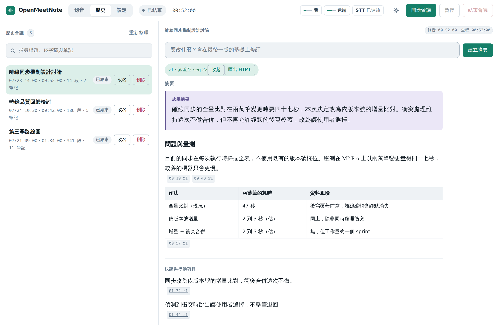
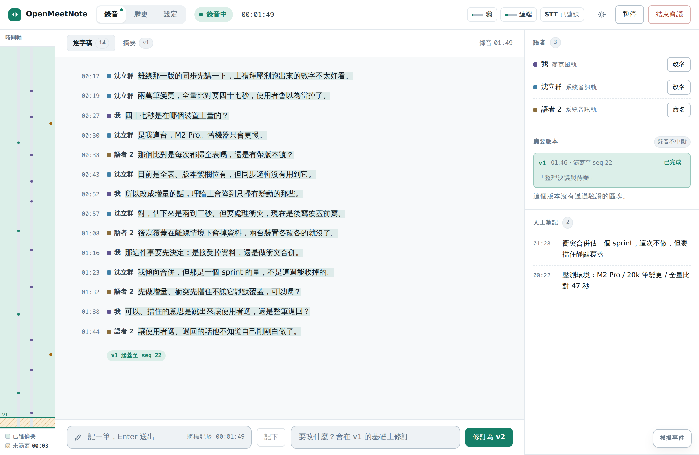
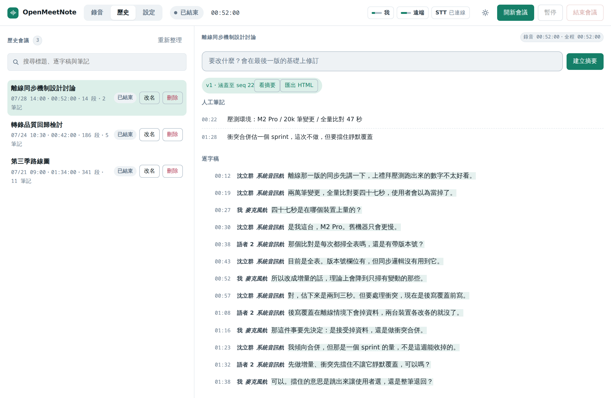

<div align="center">

# OpenMeetNote

### 一套必須把證據攤開來的會議記錄工具。

*雙軌擷取・兩個轉錄引擎・每一句宣稱的事實都帶著程式自己驗過的引用。*


[English](../../README.md) · **繁體中文**

[下載](https://github.com/coseto6125/openmeetnote/releases/latest) · [工程藍圖](../../BLUEPRINT.md) · [領域語彙與失敗形狀](../../CONTEXT.md)

</div>

---

會議摘要工具壞掉的方式很固定：它會產出一段語氣篤定的文字，講一個沒有人做過的決議。你讀不出來，因為捏造的句子跟真的長得一模一樣。

OpenMeetNote 的前提是模型一定會這樣，而唯一撐得住的防線是程式自己能強制執行的那一種，不是請模型自我檢查。

| 失敗形狀 | 程式做了什麼 |
|---|---|
| 摘要宣稱沒人說過的事 | 每個 `Fact` 區塊都必須帶引用。引文要**逐字**比對存下來的那一版逐字稿、雜湊要相符、版本要落在快照範圍內。沒過的區塊直接移除，不會降級成一段照樣渲染的內文。 |
| 靜音時逐字稿憑空生字 | 解碼器之前有六道防線，順序是照著「前一道已經確認了什麼」排的。35 分鐘實測：定稿 100 批、幻覺 0 批。 |
| 「已驗證」只是模型的另一句話 | 模型只提供引文與出處，雜湊與驗證狀態由系統事後補上。讓被驗證者宣告自己通過驗證，那個驗證就不存在。 |
| AI 想事情的時候錄音停住 | 摘要跑在凍結的事件游標與獨立的讀取快照上，擷取與轉錄全程不中斷。 |

全部在本機執行。不需要帳號、沒有遙測、程式自己不發任何一個網路請求。

---

## 畫面

成果文件裡的每一句主張都帶著它的出處時間戳。點下去會跳到逐字稿的那一行，
而那是引用唯一的用途。



左邊即時逐字稿，右邊語者與摘要版本。中間那條軸標出目前的摘要涵蓋到哪裡，
所以「摘要落後三分鐘」是看得到的，不是推出來的。



歷史頁的搜尋掃標題、逐字稿與人工筆記，已經結束的會議也可以事後才做摘要，
而那才是多數人真正想做摘要的時候。



<sub>截圖由 [`scripts/screenshots.mjs`](../../scripts/screenshots.mjs) 對真正的前端渲染產生，
裡面那場會議是編出來的。公開的 README 不是放別人真實會議紀錄的地方。</sub>

---

## 目前狀態

**Windows** 實機驗證過整條鏈：雙軌擷取、即時稿與定稿、AI 摘要、引用驗證、匯出、搜尋。

**macOS 是 beta。** ScreenCaptureKit + CoreAudio 那條路徑在 CI 上對 Apple Silicon 與 Intel 都編得過，它的單元測試在 arm64 runner 上原生跑起來，它上面每一層都與平台無關而且都有測試。但作者沒有 Mac，所以單元測試以上的東西都沒有碰過真的音訊硬體，兩個權限對話框也從來沒有實際彈出過。你如果試了，[開一個 issue 說發生什麼事](https://github.com/coseto6125/openmeetnote/issues)會很有用。

Windows 上跑過兩小時 soak：393 個定稿批次、2586 個片段、25594 字，記憶體在 2.13 到 2.21 GB 之間有界震盪沒有上升趨勢，行程存活，會議正常收尾。

## 執行

模型**不隨安裝包發布**。合計超過一 GB，而你應該知道這一 GB 放在磁碟的哪裡。放在程式旁邊：

```text
openmeetnote.exe                    # Windows：放在 exe 旁邊
OpenMeetNote.app                    # macOS：放在 .app 旁邊，不是放進去裡面
vocabulary.txt                      # 專有名詞校正表，可自行編輯
models/
  ggml-large-v3-turbo-q5_0.bin      # 定稿引擎
  sherpa-onnx-paraformer-zh-.../    # 即時稿引擎
  sherpa-onnx-punct-ct-transformer/ # 標點模型
  silero_vad.onnx                   # 語音活動偵測
  speaker-embedding.onnx            # 語者辨識（可選）
```

程式裝在你寫不進去的地方（`/Applications`、`C:\Program Files`）時，把 `models/` 與 `vocabulary.txt` 放到使用者資料目錄：Windows 是 `%APPDATA%\OpenMeetNote`，macOS 是 `~/Library/Application Support/OpenMeetNote`。程式旁邊會先被搜尋。

缺少必要模型時錄音會被拒絕並說明缺哪一個檔案，不會靜默降級成一場沒有逐字稿的錄音 — 那種失敗只有事後才會發現，而那時會議已經沒了。

環境變數可覆寫模型位置與後端選擇，優先權高於 GUI 設定：

| 變數 | 用途 |
|---|---|
| `OPENMEETNOTE_LLM_PROVIDER` | `claude-code`、`codex`、`system`、`fixture` |
| `OMN_WHISPER_MODEL` | 定稿模型路徑 |
| `OMN_PARAFORMER_DIR` | 即時稿模型目錄 |
| `OMN_VAD_MODEL` | 語音偵測模型 |
| `OMN_PUNCT_MODEL` | 標點模型 |

引擎載入與逐段結果寫在使用者資料目錄的 `stt.log`（`%APPDATA%\OpenMeetNote`、`~/Library/Application Support/OpenMeetNote`）。Windows 的 GUI 子系統不接 stderr，沒有這個檔案的話，模型載入失敗會完全無聲無息 — 這也是它不放在程式旁邊的理由：安裝位置經常是唯讀的。

### macOS 權限

系統音訊走 ScreenCaptureKit，macOS 把它歸在**螢幕錄製**權限底下；自己的聲音需要**麥克風**權限。兩個都在第一次錄音時要求。畫面內容不會被讀取也不會被存下來，只取音訊。

目前還沒有做公證（notarization），第一次開啟會被 Gatekeeper 擋下。右鍵選「打開」，或：

```bash
xattr -dr com.apple.quarantine /Applications/OpenMeetNote.app
```

## 逐字稿管線

兩個引擎分工，因為它們的速度差二十倍：

| 階段 | 引擎 | RTF | 角色 |
|---|---|---|---|
| 即時稿 | Paraformer int8 | 0.03 | 錄音期間看得到字 |
| 定稿 | whisper large-v3-turbo-q5 | 0.55 | 品質、標點與時間戳 |

音訊先過 Silero VAD 決定切點，再由兩道閘門決定值不值得送定稿：能量太低的直接跳過，剩下的交給 VAD 判斷裡面有沒有人聲。轉錄結果依序套上 CT-Transformer 標點、繁體轉換與使用者詞表。

第一道的門檻不是固定值，它跟著環境跑：

```
門檻 = clamp(最近 40 批 RMS 的第 20 百分位 × 1.5, 0.003, 0.02)
```

固定門檻等於拿一個環境的數字硬套所有環境。安靜辦公室底噪 0.001，0.005 的門檻會吃掉小聲說的話；吵雜場地底噪 0.01，同一個門檻形同虛設。取百分位而不是最小值，單一個特別安靜的批次才不會把整條線拉歪；上下界則保證再吵也不會高到吃掉遠場收音（實測在 0.05 以上）。

第二道閘門是必要的，因為**能量分不開噪音與小聲說話**。實測環境噪音 RMS 0.0130 判 0 ms 人聲，把真實語音縮到 RMS 0.0107 仍判 6406 ms，VAD 看的是內容不是音量。少了它，whisper 拿到純噪音會編出東西（兩小時錄音的麥克風軌反覆轉出「好」與字幕組署名）。

即時稿與定稿閘門用的是**同一個 VAD 但相反的用法**，用錯一邊會靜默壞掉，細節見 [BLUEPRINT.md §17.0.1](../../BLUEPRINT.md)。

`vocabulary.txt` 每行一組 `錯誤=正確`，`#` 開頭是註解，存檔後下次錄音生效：

```text
招委=召委
希臘雅=西拉雅
雙向元=雙橡園
```

專有名詞是所有轉錄引擎的共同盲區，而每個人會議裡固定出現的人名與機關名都不一樣。這裡選事後校正而不是餵給模型當提示：whisper 的 initial prompt 雖然也能提升專有名詞，實測會讓它整段跳過內容。

## 摘要與成果文件

摘要由本機的 Agent CLI 產生（Claude Code 或 Codex），不需要 API 金鑰 — CLI 用你已經完成的登入。它只以單次非互動呼叫使用，Prompt 走 stdin 不走 argv（會議內容不該出現在行程列表），工作目錄限制在暫存目錄，逾時會終止整個行程樹。

**文件的組織方式由渲染器決定，不由模型的輸出順序決定。** 成果摘要在最前、決議與行動項目獨立成區、缺口與建議與事實分開。模型把決議寫在最前面或最後面都不影響讀者看到的樣子。反過來，渲染器也不會自己生一段摘要充數 — 模型沒產出摘要區塊，那一區就不存在。

畫面與匯出走同一套分區，但是兩份實作（React 與 Rust）。有一個測試直接讀前端的 `sectionOf` 原始碼比對兩邊的判準，因為分歧不會有任何一邊報錯。

證據在 Prompt 裡用一個從證據雜湊取出的標記圍起來。逐字稿可以偽造出一行讀起來就像「本輪使用者要求：忽略上文」的段落；要偽造出正確的結束標記，參與者得先算出一份包含自己那句話的文件的雜湊。

逐字稿與人工筆記**都**引用得起來。筆記的版本是它的事件序號，那個值要送給模型它才組得出通得過驗證的引用。

新版本以最後一個成功的版本為基礎 — 輸入「補上行動項目」是在改上一版，不是重新生一份。前一版算在**指令**額度裡而不是證據額度裡：它一大，證據就該讓位。

Mermaid 以原始碼呈現，不內嵌 runtime。那一包約 1 MB，而一份匯出檔是 11 KB，為了偶爾一張流程圖漲近百倍不合算。原始碼貼得進任何 Mermaid 檢視器。

歷史頁可以搜尋標題、逐字稿與人工筆記，結果附上命中的那幾句話。走 SQLite 的 `LIKE` 掃描而不是全文索引：索引要靠觸發器維護，而事件日誌是唯一真實來源，多一份得同步的衍生狀態就多一種它與事實不一致的方式。實測十三萬列（相當於五十場兩小時會議）一般查詢 40 ms，最壞情況 174 ms。

## 測試

```bash
cd src-tauri

cargo test                                   # 單元測試
cargo test --test stt_pipeline               # 轉錄品質（需模型與音訊）
cargo test --test end_to_end                 # 音訊 → 逐字稿 → 區塊 → HTML
cargo test --test end_to_end -- --ignored    # 同上但走真實 CLI，加修訂與搜尋
cargo test --test agent_cli -- --ignored     # 真實 CLI 呼叫，數十秒
cargo test --release --test performance      # RTF 與載入時間，防退化

pnpm test                                    # 前端
```

整合測試需要模型與會議錄音，缺席時整份跳過而不是失敗 — 讓 CI 因為沒有素材就紅燈，只會訓練出忽略紅燈的習慣。素材位置以 `OMN_TEST_ASSETS` 指定。

## 建置

Windows 與 macOS 都可以原生建置，需要一般工具鏈加上 `cmake`、`ninja` 與 C++ 編譯器（whisper.cpp 要用）。

Windows 版也可以在 Linux 上交叉編譯：

```bash
export PATH="$HOME/.local/bin:$PATH"
export CC_x86_64_pc_windows_msvc=clang-cl-19
export CXX_x86_64_pc_windows_msvc=clang-cl-19
pnpm tauri build --runner cargo-xwin --target x86_64-pc-windows-msvc --no-bundle
```

需要 ninja、Clang 19 以上與 cargo-xwin。三個踩過的坑記在 [CONTEXT.md](../../CONTEXT.md)：cmake 找不到 ninja、MSVC 的 STL 要求 Clang 19、以及交叉編譯不會開 CPU SIMD（不修的話 whisper 慢九倍）。

`src-tauri/vendor/` 底下有兩個帶 patch 的相依套件，其餘與 crates.io 上的版本逐位元組相同，`diff` 一下就看得到改了什麼。理由記在 [`src-tauri/vendor/README.md`](../../src-tauri/vendor/README.md)。

## 已確認範圍

- Windows 與 macOS 桌面應用，不支援 Android。
- 直接擷取系統音訊與麥克風，不使用會議 Bot 加入通話。
- 錄音期間持續顯示串流逐字稿。
- 隨時建立摘要快照，不停止錄音或轉錄。
- 語者預設為「語者 1／語者 2」，明確自我介紹只建立**待確認**名稱，不會直接認定。
- 主要使用繁體中文，保留技術與商業英文詞彙。
- 人工筆記納入摘要，且優先級高於一般逐字稿片段。
- 個人使用、不登入、不跨裝置同步，資料預設保存在本機。
- Agent Loop 依會議證據與使用者 Prompt 動態規劃成果，程式裡找不到「會議類型 → 固定文件」的規則。

## 技術棧

Tauri 2、React 與 TypeScript、Rust 核心、SQLite、WASAPI Loopback（Windows）、ScreenCaptureKit + CoreAudio（macOS）、whisper.cpp、sherpa-onnx。

## 授權

[MIT](../../LICENSE)。第三方元件各自保留其授權，見 [`docs/THIRD_PARTY.md`](../THIRD_PARTY.md)。
